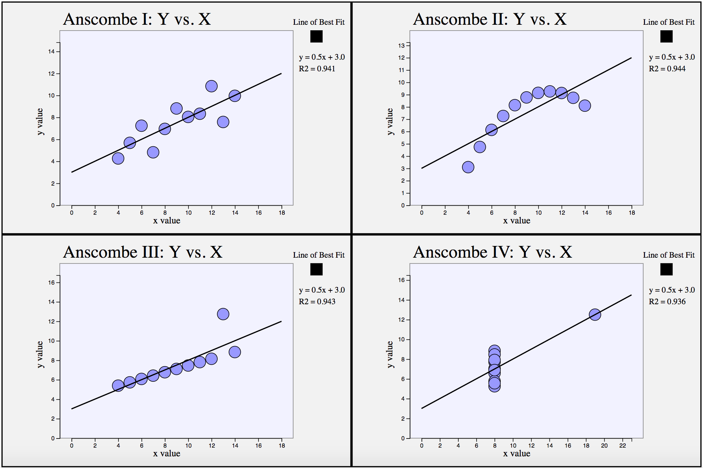

# Project 0: Visualizing Anscombe’s Quartet
</img>
## Bells Rung
- **Tooltips**

  Part 3's scatter plot has a tool-tip that displays the x-, y- coordinates of each point upon mouseover.
  
- **Xs and Ys**

  A part of barcharts was created, one for the x-data and the other for the y-data. 
  
- **Best Fit Lines**

  A line of best fit was calculated using gradient descent for each dataset, and an enable line of best fit button was added to each plot so that the line can be turned on and off. Additionally, the equation of the line is displayed, as well as the R2 value.

## Whistles Whistled
- **Transitions**

  The single scatterplot of part 3 has a menu that enables the user to transition between the four datasets. The transition is animated. 

- **Coordinate Views**

  For the barcharts of part 2, when the mouse hovers over a bar in one chart, the corresponding bar in the other chart is simultaneously highlighted. Further, each of the datasets can be independently sorted, as suggested in part 2 ("the order of the bars should correspond to either their natural order in the dataset or to the relative x-value"). When the sorting is applied, the simultaneous highlighting of the x and y charts remains intact.

## Collaborators
  None; worked independently.
